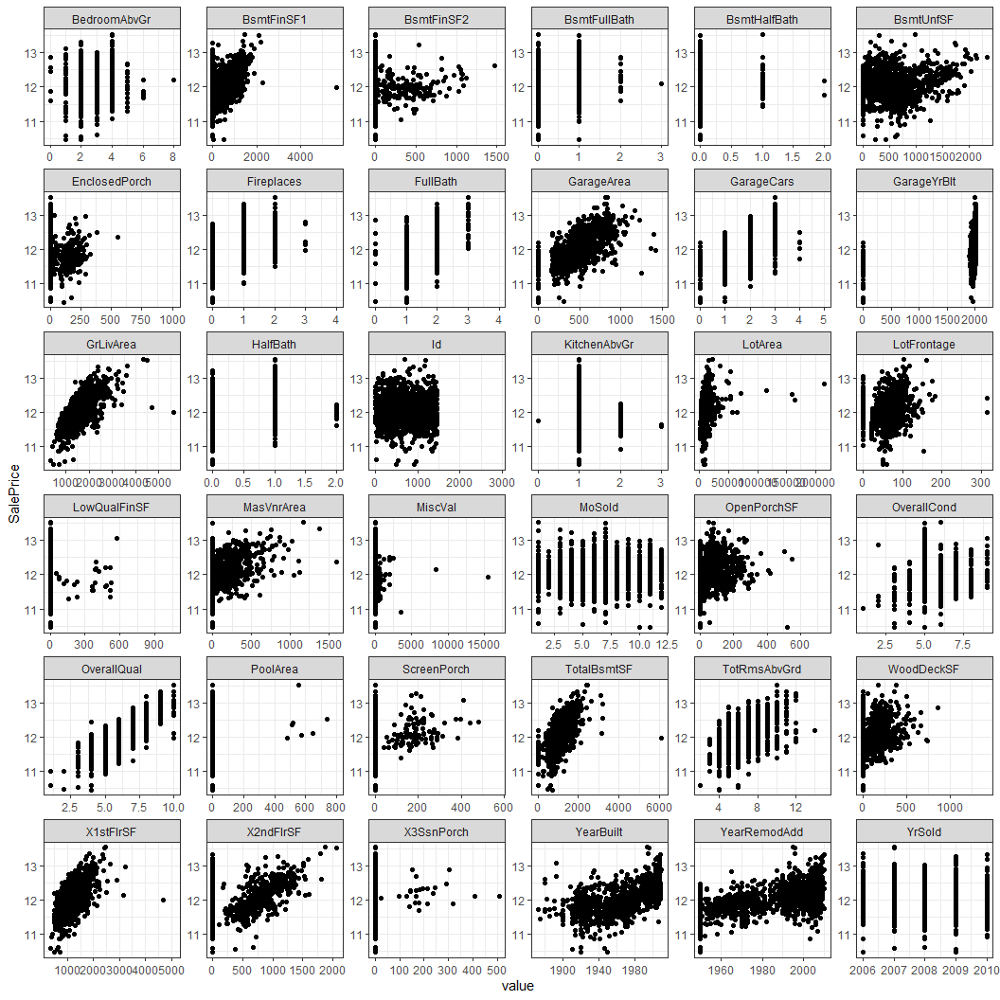
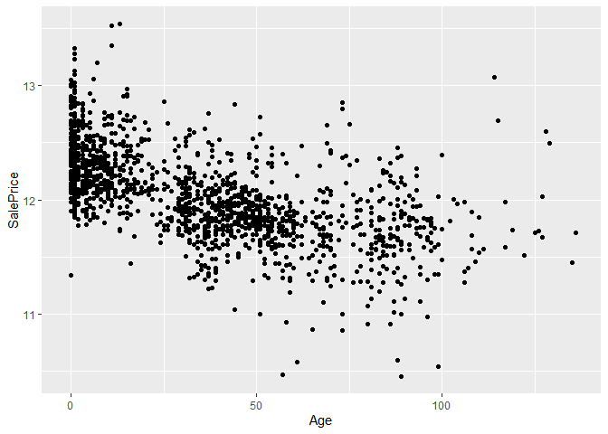
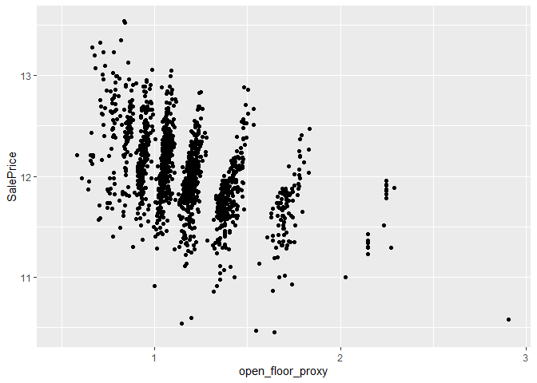
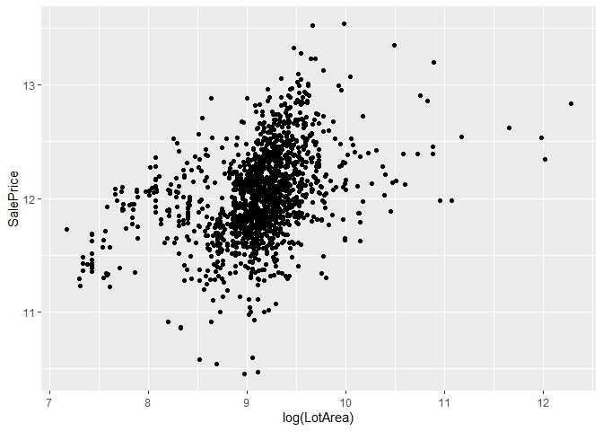
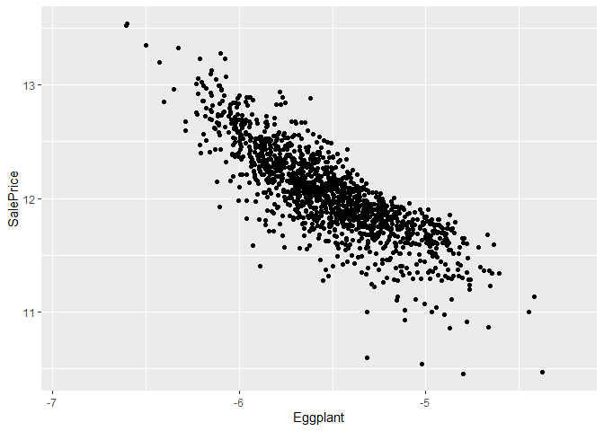

House prices
================

# Introduction

This notebook is for the prediction of property sale price. This
notebook will be split into four major sections.

1.  [processing missing analysis](#1)
2.  [exploratory analysis, e.g. correlation plots](#2)
3.  [feature engineering](#3)
4.  [modeling](#4)

My initial thoughts based on a glimpse at the data is to predict sale
price using the general features of quality, size, and location. The
time may also play a role in the sale of a home but given my limited
time working on this problem I will not prioritize time series.

# Importing

``` r
devtools::load_all()
x <- list(
"magrittr",
"tidyverse",
"purrr",
"rcompanion",
"naniar",
"caret", # for dummy and one hot encode
"glmnet",
"plotmo",
"corrr",
"corrplot")
lapply(x, require, character.only = TRUE)
```

    ## [[1]]
    ## [1] TRUE
    ## 
    ## [[2]]
    ## [1] TRUE
    ## 
    ## [[3]]
    ## [1] TRUE
    ## 
    ## [[4]]
    ## [1] TRUE
    ## 
    ## [[5]]
    ## [1] TRUE
    ## 
    ## [[6]]
    ## [1] TRUE
    ## 
    ## [[7]]
    ## [1] TRUE
    ## 
    ## [[8]]
    ## [1] TRUE
    ## 
    ## [[9]]
    ## [1] TRUE
    ## 
    ## [[10]]
    ## [1] TRUE

``` r
# IMPORTING
# Import training and test data, which we will soon combine, as we want to process explanatory variables together
dftrain <- read.csv(here::here("data-raw", "train.csv")) %>% dplyr::mutate(set = "train")
dftest <- read.csv(here::here("data-raw", "test.csv")) %>% dplyr::mutate(set = "test") %>% dplyr::mutate(SalePrice = NA)
df <- dplyr::bind_rows(dftrain, dftest)
```

# <a name="1"></a>

# Processing and missing analysis

First we take a glimpse and see if we can fix any errors. Columns with
extremely high values of NAs will be removed. We may be able to infer
categories from the missing values. Later in analysis, we may want to
reconsider miss_case_summary() which gives us percentage of missing
variables in a row. If a row has a large percentage of data missing it
may be better to exclude than to impute.

``` r
df %>%
  naniar::miss_var_summary() %>%
  dplyr::filter(pct_miss > 0) %>%
  print(n=Inf)
```

    ## # A tibble: 35 x 3
    ##    variable     n_miss pct_miss
    ##    <chr>         <int>    <dbl>
    ##  1 PoolQC         2909  99.7   
    ##  2 MiscFeature    2814  96.4   
    ##  3 Alley          2721  93.2   
    ##  4 Fence          2348  80.4   
    ##  5 SalePrice      1459  50.0   
    ##  6 FireplaceQu    1420  48.6   
    ##  7 LotFrontage     486  16.6   
    ##  8 GarageYrBlt     159   5.45  
    ##  9 GarageFinish    159   5.45  
    ## 10 GarageQual      159   5.45  
    ## 11 GarageCond      159   5.45  
    ## 12 GarageType      157   5.38  
    ## 13 BsmtCond         82   2.81  
    ## 14 BsmtExposure     82   2.81  
    ## 15 BsmtQual         81   2.77  
    ## 16 BsmtFinType2     80   2.74  
    ## 17 BsmtFinType1     79   2.71  
    ## 18 MasVnrType       24   0.822 
    ## 19 MasVnrArea       23   0.788 
    ## 20 MSZoning          4   0.137 
    ## 21 Utilities         2   0.0685
    ## 22 BsmtFullBath      2   0.0685
    ## 23 BsmtHalfBath      2   0.0685
    ## 24 Functional        2   0.0685
    ## 25 Exterior1st       1   0.0343
    ## 26 Exterior2nd       1   0.0343
    ## 27 BsmtFinSF1        1   0.0343
    ## 28 BsmtFinSF2        1   0.0343
    ## 29 BsmtUnfSF         1   0.0343
    ## 30 TotalBsmtSF       1   0.0343
    ## 31 Electrical        1   0.0343
    ## 32 KitchenQual       1   0.0343
    ## 33 GarageCars        1   0.0343
    ## 34 GarageArea        1   0.0343
    ## 35 SaleType          1   0.0343

Firstly, lets remove variables which have such a high percentage of NA
that they are not of use, even with correctly imputed values.

We know from the data description the NAs are categorical for
not-applicable. For catagorical variables we will create this level. For
numeric variables we will impute with zero. In the case of the garage
year, we impute with the year the home was built. This is not ideal as
there is likely no garage. Other options include creating a variable for
“no_garage” or excluding the garage year variable. We may circle back to
this.

``` r
# PoolQC and MiscFeatures are too heavily not-applicable and will not be useful
df <- df %>%
  dplyr::select(-c("PoolQC", "MiscFeature"))

vars_missing <- df %>%
  naniar::miss_var_summary() %>%
  dplyr::filter(pct_miss > 0) %>%
  dplyr::pull(variable)
charvars <- names(df)[sapply(df, class) == 'character']
char_vars_missing <- vars_missing[vars_missing %in% charvars]
num_vars_missing <- vars_missing[!vars_missing %in% c(charvars, "SalePrice")]
# Impute NAs with "not-appl"
df <- df %>%
  dplyr::mutate_at(char_vars_missing, ~tidyr::replace_na(., "not-appl"))  %>%
  dplyr::mutate_at(num_vars_missing, ~tidyr::replace_na(., 0)) %>%
  dplyr::mutate(GarageYrBlt = ifelse(GarageYrBlt == 0, YearBuilt, GarageYrBlt)) #custom replacement for garrageyrblt
```

Let’s also remove a few more variables which don’t contain enough
information and factor non-ordinal categories

``` r
# removing some vars that are entirely one group
df <- df %>%
  dplyr::select(-c("Street", "Utilities", "RoofMatl", "Heating"))
```

# <a name="2"></a>

# Exploratory data analysis

## Glimpse at the response variable (sale price)

``` r
# RESPONSE VARIABLE (move this past processing to EDA)
# check dist of response var is statistically different from normal
hist(dftrain$SalePrice,probability=T, main="Histogram of sales price", 50)
norm <- rnorm(100000, mean(dftrain$SalePrice), sd(dftrain$SalePrice))
lines(density(dftrain$SalePrice), col=1)
lines(density(norm),col=2)
```

<!-- -->

``` r
# pointy dist with heavy tail on the right
shapiro.test(dftrain$SalePrice)
```

    ## 
    ##  Shapiro-Wilk normality test
    ## 
    ## data:  dftrain$SalePrice
    ## W = 0.86967, p-value < 2.2e-16

Sales price has a heavy right tail and a pointy distribution (black
line). Based on the shapiro test it is significantly different from a
normal distribution. We log scale to obtain a more normal distribution.

``` r
df <- df %>%
  dplyr::mutate(SalePrice = log(SalePrice))
hist(df$SalePrice,probability=T, main="Histogram of sales price", 50)
```

<!-- -->

## Correlation

Now that we have done some of our cleaning complete we can take a look
at correlation plots. I’m going to separate nominal and numeric for most
of this section for plot readability and for the following sections
which handle these data types differently.

``` r
charvars <- names(df)[sapply(df, class) == 'character']
dftemp <- df %>%
  dplyr::mutate_at(charvars, as.factor) %>%
  dplyr::mutate(MSSubClass = as.factor(MSSubClass))


nom_vars <- names(dftemp)[sapply(dftemp, class) == 'factor']
num_ord_vars <- names(dftemp)[!names(dftemp) %in% nom_vars]

tempnom <- dftemp %>%
  dplyr::select(c("SalePrice", nom_vars)) %>% # including sale price with ordinal as well
  dplyr::select(-set) %>%
  mixed_assoc() %>%
  dplyr::select(x, y, assoc) %>%
  tidyr::spread(y, assoc) %>%
  tibble::column_to_rownames("x")
```

    ## Note: Using an external vector in selections is ambiguous.
    ## i Use `all_of(nom_vars)` instead of `nom_vars` to silence this message.
    ## i See <https://tidyselect.r-lib.org/reference/faq-external-vector.html>.
    ## This message is displayed once per session.

``` r
tempnum <- dftemp %>%
  dplyr::select(c("SalePrice", num_ord_vars)) %>% # including sale price with ordinal as well
  mixed_assoc() %>%
  dplyr::select(x, y, assoc) %>%
  tidyr::spread(y, assoc) %>%
  tibble::column_to_rownames("x")
```

    ## Note: Using an external vector in selections is ambiguous.
    ## i Use `all_of(num_ord_vars)` instead of `num_ord_vars` to silence this message.
    ## i See <https://tidyselect.r-lib.org/reference/faq-external-vector.html>.
    ## This message is displayed once per session.

``` r
temp <- dftemp %>%
  dplyr::select(c("SalePrice", num_ord_vars, nom_vars)) %>% # including sale price with ordinal as well
  dplyr::select(-set) %>%
  mixed_assoc() %>%
  dplyr::select(x, y, assoc) %>%
  tidyr::spread(y, assoc) %>%
  tibble::column_to_rownames("x")

# allowing for all overlap text
options(ggrepel.max.overlaps = Inf)

tempnom %>%
  as.matrix %>%
  corrr::as_cordf() %>%
  corrr::network_plot(min_cor = 0.3) 
```

<!-- -->

``` r
# corrplot::corrplot(tempnom %>% as.matrix %>% .[dim(tempnom)[1]:1,dim(tempnom)[1]:1], method = 'square', order = 'FPC', type = 'lower', diag = TRUE, tl.col = "black", tl.cex=.75)

tempnum %>%
  as.matrix %>%
  corrr::as_cordf() %>%
  corrr::network_plot(min_cor = 0.3)
```

<!-- -->

``` r
corrplot::corrplot(temp %>% as.matrix %>% .[dim(temp)[1]:1,dim(temp)[1]:1], method = 'square', order = 'FPC', type = 'lower', diag = TRUE, tl.col = "black", tl.cex=.25)
```

<!-- -->

## Correlation plot

### Nominal variables

The results from the nominal network plot show three main clusters which
describe the three main aspects of the data: location (upper left),
quality(upper right), and size(lower left). It is neat to see the
aspects having distance from each other in the network plot. Given the
distance (non-correlation) between location and other aspect variables,
and the limited number of location variables, it may be vital to squeeze
the most out of these location variables.

### Numeric(continuous and ordinal) variables

The number of variables describing the size and quality is very high.
There is a great amount of corelation within these variables.

### Mixed association heatmap

The heatmap displays both numeric and nominal variables together. There
are several variables which are highly correlated with each other
e.g. garage and year built, MSSubClass and year built, etc. Niche item
like features such as screened porches, pools, fences, etc, do not seem
to be very correlated with the outcome.

## Select plots of highly correlated variables

``` r
library(ggplot2)
ggplot(df) +
  geom_point(aes(x = GrLivArea, y = SalePrice))
```

<!-- --> We see two
clear outliers on the right hand side beyond 4500. I imagine these may
be older homes or commercial properties. Otherwise, it may be an oddity
in the calculation of GrLivArea (in which calculation is unknown).

``` r
df %>% 
  dplyr::filter(GrLivArea > 4500) %>%
  dplyr::select(GrLivArea, YearBuilt, OverallQual, SaleType, MSZoning, TotalBsmtSF, set)
```

    ##   GrLivArea YearBuilt OverallQual SaleType MSZoning TotalBsmtSF   set
    ## 1      4676      2007          10      New       RL        3138 train
    ## 2      5642      2008          10      New       RL        6110 train
    ## 3      5095      2008          10      New       RL        5095  test

``` r
df <- df %>%
  dplyr::filter(!(GrLivArea > 4500 & set == "train"))
```

They are not old or commercial properties. The square footage (SF) seems
to be erroneous. I am unable to determine if other information in these
rows is erroneous so I chose to remove the rows.

``` r
ggplot(df) +
  geom_point(aes(x = GarageArea, y = SalePrice))
```

<!-- -->

A few outliers on the right and side. I don’t suspect they are erroneous
and I will leave these rows. The zeros are for houses without garage.

``` r
hist(df$GarageArea,probability=T, main="Histogram of GarageArea", 50)
norm <- rnorm(100000, mean(df$GarageArea), sd(df$GarageArea))
lines(density(df$GarageArea), col=1)
lines(density(norm),col=2)
```

<!-- -->

``` r
shapiro.test(df$GarageArea)
```

    ## 
    ##  Shapiro-Wilk normality test
    ## 
    ## data:  df$GarageArea
    ## W = 0.97649, p-value < 2.2e-16

This distribution is not normal for a few reasons (zeros, multiple
peaks, skewness). The multiple peaks which is intuitive as there are
1,2,3 car garage sizes. If we were to bin this variable to may be too
correlated with the variable that describes the number of cars the
garage fits.

``` r
ggplot(df, aes(x=as.factor(OverallQual), y=SalePrice)) +
  geom_violin() +
  geom_boxplot(width=0.1)
```

<!-- -->

## Sparse modeling

Gertheiss and Tutz 2010

This paper presents Lasso-like solution paths that show how levels of
two categorical variables get merged together when regularization
strength increases. I wont be using weights as suggested in the paper
but borrowing the general concept.

For sparse categorical data we will collapse them into fewer groupings.
One hot encoding is used for LASSO.

Let’s take a glimpse at counts for categorical variables (not including
ordinal).

``` r
nomvars <- names(df)[sapply(df, class) == 'factor']
temp <- df %>% 
  dplyr::select(nomvars)
```

    ## Note: Using an external vector in selections is ambiguous.
    ## i Use `all_of(nomvars)` instead of `nomvars` to silence this message.
    ## i See <https://tidyselect.r-lib.org/reference/faq-external-vector.html>.
    ## This message is displayed once per session.

``` r
summary(temp)
```

    ## < table of extent 0 x 0 >

The following variables caught my eye in terms of usefulness from
correlation, and in terms of having too many/too small categories.

``` r
nomvars_of_interest <- c(
"Neighborhood",
"MSZoning",
"SaleCondition",
"BsmtExposure",
"KitchenQual",
"GarageType",
"PavedDrive")


df2 <- df %>%
  dplyr::select(c(nomvars_of_interest, "set")) %>%
  dplyr::mutate_at(nomvars_of_interest, as.factor) %>%
  dplyr::filter(set == "train") %>%
  dplyr::select(-set)
```

    ## Note: Using an external vector in selections is ambiguous.
    ## i Use `all_of(nomvars_of_interest)` instead of `nomvars_of_interest` to silence this message.
    ## i See <https://tidyselect.r-lib.org/reference/faq-external-vector.html>.
    ## This message is displayed once per session.

``` r
library(caret)
dummy <- dummyVars(" ~ .", data=df2)
df3 <- data.frame(predict(dummy, newdata = df2))
y <- df %>%
  dplyr::filter(set == "train") %>%
  dplyr::pull(SalePrice)


library(glmnet)
library(plotmo)
# Lets do individual lasso instead
# Can we figure out weights from munic real estate paper?
for (name in names(df2)) {
dftemp <- df3 %>% dplyr::select(dplyr::starts_with(name))
print(df3 %>% dplyr::select(dplyr::starts_with(name)) %>% colnames)
fit <- glmnet(dftemp, y = y, alpha = 1) #alpha 1 is lasso, 0 is ridge
plot_glmnet(fit, label=TRUE)
}
```

    ##  [1] "Neighborhood.Blmngtn" "Neighborhood.Blueste" "Neighborhood.BrDale" 
    ##  [4] "Neighborhood.BrkSide" "Neighborhood.ClearCr" "Neighborhood.CollgCr"
    ##  [7] "Neighborhood.Crawfor" "Neighborhood.Edwards" "Neighborhood.Gilbert"
    ## [10] "Neighborhood.IDOTRR"  "Neighborhood.MeadowV" "Neighborhood.Mitchel"
    ## [13] "Neighborhood.NAmes"   "Neighborhood.NoRidge" "Neighborhood.NPkVill"
    ## [16] "Neighborhood.NridgHt" "Neighborhood.NWAmes"  "Neighborhood.OldTown"
    ## [19] "Neighborhood.Sawyer"  "Neighborhood.SawyerW" "Neighborhood.Somerst"
    ## [22] "Neighborhood.StoneBr" "Neighborhood.SWISU"   "Neighborhood.Timber" 
    ## [25] "Neighborhood.Veenker"

<!-- -->

    ## [1] "MSZoning.C..all."  "MSZoning.FV"       "MSZoning.not.appl"
    ## [4] "MSZoning.RH"       "MSZoning.RL"       "MSZoning.RM"

<!-- -->

    ## [1] "SaleCondition.Abnorml" "SaleCondition.AdjLand" "SaleCondition.Alloca" 
    ## [4] "SaleCondition.Family"  "SaleCondition.Normal"  "SaleCondition.Partial"

<!-- -->

    ## [1] "BsmtExposure.Av"       "BsmtExposure.Gd"       "BsmtExposure.Mn"      
    ## [4] "BsmtExposure.No"       "BsmtExposure.not.appl"

<!-- -->

    ## [1] "KitchenQual.Ex"       "KitchenQual.Fa"       "KitchenQual.Gd"      
    ## [4] "KitchenQual.not.appl" "KitchenQual.TA"

<!-- -->

    ## [1] "GarageType.2Types"   "GarageType.Attchd"   "GarageType.Basment" 
    ## [4] "GarageType.BuiltIn"  "GarageType.CarPort"  "GarageType.Detchd"  
    ## [7] "GarageType.not.appl"

<!-- -->

    ## [1] "PavedDrive.N" "PavedDrive.P" "PavedDrive.Y"

<!-- -->

# <a name="sparse2"></a>

## Sparse modeling (continued)

1.  [MSZoning](#sparse2) This variable is difficult to collapse due to
    unusual types of location such as floating villages which do not bin
    well in terms being similar. This may not work.
2.  [Neighborhood_bigbin](#sparse2) Collapsing using LASSO groups.
3.  [Neighborhood](#sparse2) This is a hack (ideally should do something
    else) such that we have enough unique values within group to use
    quantile in feature engineering.
4.  [BsmtQual](#sparse2) Collapsing some of the smaller categories.
5.  [BsmtExposure](#sparse2) Collapsing into an indicator.
6.  [GarageType](#sparse2)Collapsing some of the smaller categories.
7.  [KitchenQual](#sparse2) Collapsing some of the smaller categories.
8.  [SaleCondition](#sparse2) Collapsing to norm, abnorm, and partial,
    other categories coefs get zeroed out early / not enough data

``` r
df <- df %>%
  dplyr::mutate(MSZoning = ifelse(MSZoning %in% c("RH","C (all)", "FV", "not-appl", "RM"), "RM", "RL")) %>%
  dplyr::mutate(Neighborhood_bigbin = ifelse(Neighborhood %in% c("NoRidge", "NridgHt", "StoneBr"), "top",
                                       ifelse(Neighborhood %in% c("IDOTRR", "MeadowV", "BrDale"), "bottom",
                                              ifelse(Neighborhood %in% c("BrkSide", "OldTown", "Edwards", "Sawyer", "Blueste", "SWISU","NAmes", "NPkVill", "Mitchel"), "midlow",
                                                     ifelse(Neighborhood %in% c("NWAmes", "Gilbert", "CollgCr", "Blmngtn", "Crawfor", "ClearCr","Somerst", "Veenker", "Timber", "SawyerW"), "midupp", NA))))) %>% #ideally we would have spatial or hierarchical model for these groups
   dplyr::mutate(Neighborhood = ifelse(Neighborhood %in% c("BrDale", "IDOTRR"), "MeadowV", Neighborhood)) %>% #small hack for later feature that requires more samples
  dplyr::mutate(BsmtQual = ifelse(BsmtQual %in% c("TA", "not-appl", "Fa"), 0,
                                  ifelse(BsmtQual %in% c("Gd"), 1,
                                         ifelse(BsmtQual %in% c("Ex"), 2, NA)))) %>%
  dplyr::mutate(GarageType = ifelse(GarageType %in% c("BuiltIn", "Attchd"), 1, 0)) %>%
  dplyr::mutate(BsmtExposure = ifelse(BsmtExposure == "Gd", 1, 0)) %>%
  dplyr::mutate(KitchenQual = ifelse(KitchenQual == "Ex", "Ex",
                                     ifelse(KitchenQual == "Gd", "Gd", "NW"))) %>%
  dplyr::mutate(SaleCondition = ifelse(SaleCondition == "Normal", "Normal",
                                       ifelse(SaleCondition == "Partial", "Partial", "Abnorml")))


# collapsing some more straight forward vars based on data definitions
df <- df %>%
  dplyr::mutate(PavedDrive = ifelse(PavedDrive == "P", "N", PavedDrive)) %>%
  dplyr::mutate(has_fireplace = ifelse(Fireplaces == 0, 0, 1))
```

# <a name="3"></a>

# Feature engineering

## Homogeneous neighborhood condition

My wife was watching and convinced me to make this one :) The idea here
is that in a wealthy neighborhood, all of the homes should be in good
condition. i.e. little variability in the nearby home condition.

``` r
sdcondi <- sd(df$OverallCond)
df <- df %>%
  dplyr::group_by(Neighborhood) %>%
  dplyr::mutate(neighborhood_condi = sd(OverallCond) - sdcondi) %>%
  dplyr::mutate(neighborhood_condi_ind = ifelse(neighborhood_condi < -.8, 1,0)) %>%
  dplyr::ungroup()

ggplot(df) +
  geom_point(aes(x = neighborhood_condi, y = SalePrice))
```

<!-- -->

``` r
ggplot(df) +
  geom_boxplot(aes(x = as.factor(neighborhood_condi_ind), y = SalePrice))
```

<!-- -->

## Age and year

Let’s obtain how recently home was built / remodeled as those provide
different information from the year. The year/ month can provide time
series information and categorized year could provide information on
home style (e.g. mid century modern homes built 1950-1969) but we will
leave for that another time. Since we are limited on time, let’s also
obtain a simple season indicator which is more simple than time series.

``` r
df <- df %>%
  dplyr::mutate(Age = YrSold-YearBuilt) %>%
  dplyr::mutate(AgeOfRemodel = YrSold-YearRemodAdd) %>%
  dplyr::mutate(SeasonalSell = ifelse(MoSold %in% c(3,4,5,6,7,8), 1,0)) 
ggplot(df) +
  geom_point(aes(x = Age, y = SalePrice))
```

<!-- -->

## Liveable square feet (SF)

I want to improve upon the square footage variables of the home (similar
to the idea behind the given above ground SF variable). As a home buyer
myself, I find listed square footage essential but often misleading as
it can refer to basement square footage (SF), or poorly utilized SF.
Basement SF is the most misleading so it will be my focus here. Since we
have square footage breakdown we can sum them in a custom way to create
a heuristic total square footage we will call this `LiveableModSF`.

``` r
# # here is an example which breaks down my heuristic factors (essentially I wanted to basement SF to have a varying heuristic multiplier which max out around 1 such that above ground SF is more valuable. Utilizing basement bathrooms to show value in realization of basement as an addition floor to the house)
# BsmtFullBath <- c(0,1,2,3)
# BsmtHalfBath <- c(0,1,2,1)
# BsmtQual <- c(0,.1,.1,.2)
# BsmtExposure <- c(1,1,1,1)
# bbath1 <- log(BsmtFullBath+2)*.3
# bbath2 <- log(BsmtHalfBath+2)*.15
# (((bbath1 + bbath2)/2)+BsmtQual+.3*BsmtExposure)#*BsmtFinSF1


df <- df %>%
  dplyr::mutate(LiveableModSF = (((log(BsmtFullBath+2)*.3 + log(BsmtHalfBath+2)*.15)/2)+(BsmtQual/10)+.3*BsmtExposure)*BsmtFinSF1 + X1stFlrSF + X2ndFlrSF + GarageType*GarageArea*.5) #garage SF gets zeroed if not attached to the house. attached garage makes home look bigger, feel bigger, curb appeal, etc
ggplot(df) +
  geom_point(aes(x = LiveableModSF, y = SalePrice))
```

<!-- -->

## Open floor plan

Going a step further with total SF, let’s see if we can proxy for homes
with open floor plans.

``` r
df <- df %>% 
  dplyr::mutate(open_floor_proxy = X1stFlrSF/log(TotRmsAbvGrd))
ggplot(df) +
  geom_point(aes(x = open_floor_proxy, y = SalePrice))
```

<!-- -->

## Total number of bathrooms (zillow search feature :))

As a home buyer I know the total number of bathrooms is important
especially for families.

``` r
df <- df %>% 
  dplyr::mutate(BathTotal= FullBath + BsmtFullBath + (1/2)*HalfBath + (1/2)*BsmtHalfBath) 
```

## Quality materials that are in good condition!

As a home buyer I’m familiar with old homes (like one I am in the middle
of purchasing) with quality materials not selling very well due to the
condition. Wood floors that need to be refinished can dramatically
decrease sale value! Let’s express this with a new feature.

``` r
df <- df %>%
  dplyr::mutate(ConditionalQuality = OverallQual*OverallCond)
ggplot(df) +
  geom_point(aes(x = ConditionalQuality, y = SalePrice))
```

<!-- -->

## Keeping up with the Jones!

The value of the size of the lot depends greatly on its location. e.g. a
large lot near a city or in a wealthy neighborhood is going to cost
more. This may not be useful within this dataset if this dataset is all
contained within a town! I think this is a variable that would be useful
with a larger dataset. Lets give it a try! We are hacking up a
neighborhood specific esque lot size variable. Compare your lot to your
neighbors lot. Mixed effects may be more useful here but we won’t be
experimenting with those models today.

``` r
quants <- df %>%
  dplyr::group_by(Neighborhood) %>%
  dplyr::summarise(zone_quant = quantile(LotArea, c(0, .25, 0.5, .75, 1)))
```

    ## `summarise()` has grouped output by 'Neighborhood'. You can override using the
    ## `.groups` argument.

``` r
nnames <- unique(df$Neighborhood)
neighborhood_specific_quantile <- list()

for(name in nnames){
  neighborhood_specific_quantile[[name]] <-  quants %>% 
  dplyr::filter(Neighborhood == name) %>%
  dplyr::pull(zone_quant)
  neighborhood_specific_quantile[[name]][1] <- 0
}

df <- df %>%
  dplyr::rowwise() %>%
  dplyr::mutate(keeping_up_with_jones = 
                  as.factor(
                    cut(LotArea, 
                        breaks = neighborhood_specific_quantile[[as.character(Neighborhood)]], 
                        labels = c(1,2,3,4), 
                        include.lowest=TRUE,
                        )
                    )
                )


ggplot(df) +
  geom_violin(aes(x = keeping_up_with_jones, y = SalePrice))
```

<!-- -->

## Eggplant

I’m going all out on my basement theory here. I think the proportion of
the total SF which is in the basement impacts the home price. e.g. a one
story home with all its SF in the basement.

First Making indicators for basement and garage then overwriting zeros
with 1s such that I can work with log

``` r
df <- df %>%
  dplyr::mutate(has_basement = ifelse(TotalBsmtSF!=0,1,0)) %>%
  dplyr::mutate(has_garage = ifelse(GarageArea !=0,1,0)) %>%
  dplyr::mutate(GarageArea2 = ifelse(GarageArea ==0, 1, GarageArea)) %>%
  dplyr::mutate(TotalBsmtSF2 = ifelse(TotalBsmtSF == 0, 1, TotalBsmtSF))
```

Imputing the row without basement with mean for the Eggplant variable.

``` r
df <- df  %>%
  dplyr::mutate(Eggplant = (log(log(TotalBsmtSF2)/LiveableModSF))) %>%
  dplyr::mutate(Eggplant = ifelse(!is.finite(Eggplant), NA, Eggplant)) %>%
  dplyr::mutate(Eggplant = ifelse(is.na(Eggplant), mean(Eggplant, na.rm=TRUE), Eggplant))

ggplot(df) +
  geom_point(aes(x = Eggplant, y = SalePrice))
```

<!-- -->

``` r
# hack to fix my dplyr mistake above
df$Eggplant[which(is.na(df$Eggplant))] <- mean(df$Eggplant, na.rm = TRUE)
```

# <a name="4"></a>

# Modeling fitting

## Feature selection

First we will remove variables which we our intuition tells us will not
be useful due to redundant information, extremely low correlation, or
sample size too small.

Next we will let feature importance across multiple models decide which
features we keep. (top half of variables ranked)

We will not transform some of the continuous variables with zeros
e.g. garage and basement as it will create even more distance between
the meaningful zeros and the other values.

``` r
# transforming continuous feature
df <- df %>%
  dplyr::mutate(LiveableModSF = log(LiveableModSF),
                GrLivArea = log(GrLivArea))

# turning categories that were numeric into factors
df <- df %>%
  dplyr::mutate(YrSold = as.factor(as.character(YrSold))) %>%
  dplyr::mutate(MSSubClass = as.factor(as.character(MSSubClass)))
```

``` r
# install.packages("drat", repos="https://cran.rstudio.com")
# drat:::addRepo("dmlc")
# install.packages("xgboost", repos="http://dmlc.ml/drat/", type = "source")
x <- list(
"xgboost",
"randomForest",
"gbm",
"earth")
lapply(x, require, character.only = TRUE)
```

    ## Loading required package: xgboost

    ## 
    ## Attaching package: 'xgboost'

    ## The following object is masked from 'package:dplyr':
    ## 
    ##     slice

    ## Loading required package: randomForest

    ## randomForest 4.7-1.1

    ## Type rfNews() to see new features/changes/bug fixes.

    ## 
    ## Attaching package: 'randomForest'

    ## The following object is masked from 'package:dplyr':
    ## 
    ##     combine

    ## The following object is masked from 'package:ggplot2':
    ## 
    ##     margin

    ## Loading required package: gbm

    ## Loaded gbm 2.1.8

    ## Loading required package: earth

    ## [[1]]
    ## [1] TRUE
    ## 
    ## [[2]]
    ## [1] TRUE
    ## 
    ## [[3]]
    ## [1] TRUE
    ## 
    ## [[4]]
    ## [1] TRUE

``` r
toremove <-
  c(
    "LandContour",
    "LotConfig",
    "LandSlope",
    "LotShape",
    "Condition2",
    "BldgType",
    "HouseStyle",
    "RoofStyle",
    "MasVnrType",
    "Exterior2nd",
    "Exterior1st",
    "BsmtFinType2",
    "BsmtFinSF2",
    "BsmtFinSF1",
    "BsmtFullBath",
    "BsmtHalfBath",
    "FullBath",
    "BedroomAbvGr",
    "KitchenAbvGr",
    "GarageYrBlt",
    "GarageFinish",
    "WoodDeckSF",
    "Fence",
    "PoolArea",
    "ScreenPorch",
    "HeatingQC",
    "Neighborhood"
  )
dfmodel <- df %>%
  dplyr::select(-toremove)
```

    ## Note: Using an external vector in selections is ambiguous.
    ## i Use `all_of(toremove)` instead of `toremove` to silence this message.
    ## i See <https://tidyselect.r-lib.org/reference/faq-external-vector.html>.
    ## This message is displayed once per session.

``` r
# one hot encode
nomvars <- names(dfmodel)[sapply(dfmodel, class) %in% c('factor',"character")]
df2 <- dfmodel %>%
  dplyr::mutate_at(nomvars, as.factor)%>%
  dplyr::select(nomvars) %>%
  dplyr::select(-set)
dummy <- dummyVars(" ~ .", data=df2, fullRank = FALSE)
df2 <- data.frame(predict(dummy, newdata = df2))
dffinal <- cbind(df2, dfmodel %>% dplyr::select(-nomvars))
dffinal$set <- df$set


data <- dffinal %>%
  dplyr::filter(set == "train") %>%
  dplyr::select(-set) %>%
  dplyr::select(-Id)
outcome <- data$SalePrice
data <- data %>%
  dplyr::select(-SalePrice)


library(SuperLearner)
```

    ## Loading required package: nnls
    ## Loading required package: gam
    ## Loading required package: splines
    ## Loading required package: foreach
    ## 
    ## Attaching package: 'foreach'
    ## 
    ## The following objects are masked from 'package:purrr':
    ## 
    ##     accumulate, when
    ## 
    ## Loaded gam 1.20.1
    ## 
    ## Super Learner
    ## Version: 2.0-28
    ## Package created on 2021-05-04

``` r
listWrappers()
```

    ## All prediction algorithm wrappers in SuperLearner:

    ##  [1] "SL.bartMachine"      "SL.bayesglm"         "SL.biglasso"        
    ##  [4] "SL.caret"            "SL.caret.rpart"      "SL.cforest"         
    ##  [7] "SL.earth"            "SL.extraTrees"       "SL.gam"             
    ## [10] "SL.gbm"              "SL.glm"              "SL.glm.interaction" 
    ## [13] "SL.glmnet"           "SL.ipredbagg"        "SL.kernelKnn"       
    ## [16] "SL.knn"              "SL.ksvm"             "SL.lda"             
    ## [19] "SL.leekasso"         "SL.lm"               "SL.loess"           
    ## [22] "SL.logreg"           "SL.mean"             "SL.nnet"            
    ## [25] "SL.nnls"             "SL.polymars"         "SL.qda"             
    ## [28] "SL.randomForest"     "SL.ranger"           "SL.ridge"           
    ## [31] "SL.rpart"            "SL.rpartPrune"       "SL.speedglm"        
    ## [34] "SL.speedlm"          "SL.step"             "SL.step.forward"    
    ## [37] "SL.step.interaction" "SL.stepAIC"          "SL.svm"             
    ## [40] "SL.template"         "SL.xgboost"

    ## 
    ## All screening algorithm wrappers in SuperLearner:

    ## [1] "All"
    ## [1] "screen.corP"           "screen.corRank"        "screen.glmnet"        
    ## [4] "screen.randomForest"   "screen.SIS"            "screen.template"      
    ## [7] "screen.ttest"          "write.screen.template"

``` r
# I know these model types are robust to multicolinearity
learners <- c("SL.xgboost", "SL.glmnet")

# Stack models
set.seed(840) # for reproducibility

sl <- CV.SuperLearner(Y = outcome, X = data, SL.library = learners, 
                   cvControl =list(V = 5), innerCvControl = list(list(V=5)))
summary(sl)
```

    ## 
    ## Call:  
    ## CV.SuperLearner(Y = outcome, X = data, SL.library = learners, cvControl = list(V = 5),  
    ##     innerCvControl = list(list(V = 5))) 
    ## 
    ## Risk is based on: Mean Squared Error
    ## 
    ## All risk estimates are based on V =  5 
    ## 
    ##       Algorithm      Ave        se      Min      Max
    ##   Super Learner 0.012678 0.0010271 0.010733 0.016164
    ##     Discrete SL 0.013544 0.0010492 0.011460 0.017517
    ##  SL.xgboost_All 0.014529 0.0011102 0.012580 0.016766
    ##   SL.glmnet_All 0.013544 0.0010492 0.011460 0.017517

``` r
ctrl <- SuperLearner.CV.control(V = 5L, shuffle = TRUE)
sl <- SuperLearner(Y = outcome, X = data, SL.library = learners, verbose = TRUE,
                   cvControl = ctrl)
```

    ## Number of covariates in All is: 163
    ## CV SL.xgboost_All
    ## CV SL.glmnet_All
    ## Number of covariates in All is: 163
    ## CV SL.xgboost_All
    ## CV SL.glmnet_All
    ## Number of covariates in All is: 163
    ## CV SL.xgboost_All
    ## CV SL.glmnet_All
    ## Number of covariates in All is: 163
    ## CV SL.xgboost_All
    ## CV SL.glmnet_All
    ## Number of covariates in All is: 163
    ## CV SL.xgboost_All
    ## CV SL.glmnet_All
    ## Non-Negative least squares convergence: TRUE
    ## full SL.xgboost_All
    ## full SL.glmnet_All

``` r
imp_fun <- function(object, newdata) { # for permutation-based VI scores
predict(object, newdata = newdata)$pred
}
par_fun <- function(object, newdata) { # for PDPs
mean(predict(object, newdata = newdata)$pred)
}
library(doParallel) # load the parallel backend
```

    ## Loading required package: iterators
    ## Loading required package: parallel

``` r
cl <- makeCluster(5) # use 5 workers
registerDoParallel(cl)

var_imp <- vip::vi(sl, method = "permute", train = data, target = outcome, metric = "rmse",
              pred_wrapper = imp_fun, nsim = 5, parallel = TRUE)
# Add sparkline representation of feature effects (# Figure 19)
vip::add_sparklines(var_imp[1L:15L, ], fit = sl, pred.fun = par_fun, train = data,
digits = 2, verbose = TRUE, trim.outliers = TRUE,
grid.resolution = 20, parallel = TRUE)
```

    ## Computing partial dependence...
    ##   LiveableModSF
    ##   TotalBsmtSF
    ##   OverallQual
    ##   ConditionalQuality
    ##   GrLivArea
    ##   Age
    ##   X2ndFlrSF
    ##   LotArea
    ##   X1stFlrSF
    ##   GarageArea
    ##   BsmtUnfSF
    ##   SaleCondition.Abnorml
    ##   OverallCond
    ##   YearBuilt
    ##   BathTotal

<!-- -->

Feature selection based on importance.

``` r
varvec <- var_imp$Variable
varvec <- gsub("\\..*","",varvec)
varvecun <- unique(varvec)
varvecun_short <- varvecun[1:round(length(varvecun)/2)]
dfmodel <- df %>%
  dplyr::select(varvecun_short)
```

## Final model

I lack experience tuning specific ML - for simplicity using default
settings. Future work would be tuning.

``` r
nomvars <- names(dfmodel)[sapply(dfmodel, class) %in% c('factor',"character")]
dffinal <- dfmodel %>%
  dplyr::mutate_at(nomvars, as.factor)
  

#  one hot encode
df2 <- dffinal %>%
  dplyr::select(nomvars) 
dummy <- dummyVars(" ~ .", data=df2, fullRank = FALSE)
df2 <- data.frame(predict(dummy, newdata = df2))
dffinal <- cbind(df2, dffinal %>% dplyr::select(-nomvars))
dffinal$set <- df$set

data <- dffinal %>%
  dplyr::filter(set == "train") %>%
  dplyr::select(-set) 
outcome <- df %>% 
  dplyr::filter(set == "train")%>%
  dplyr::pull(SalePrice)

 
data_test <- dffinal %>%
  dplyr::filter(set == "test") %>%
  dplyr::select(-set) 


SuperLearner::listWrappers()

learners <- list("SL.lm", "SL.xgboost", "SL.earth", c("SL.glmnet","screen.glmnet"),  "SL.randomForest") 

# Stack models
set.seed(840) # for reproducibility
sl <- SuperLearner::SuperLearner(Y = outcome, X = data,
  SL.library = learners)
sl

pred <- predict(sl, data_test, onlySL = TRUE)
final <- data.frame(Id = df %>% dplyr::filter(set == "test") %>% dplyr::pull(Id), SalePrice = exp(pred$pred))
write.csv(final, row.names = FALSE, "predictions.csv")
```

## Future work

catboost, tuning, time series analysis, mixed modeling
